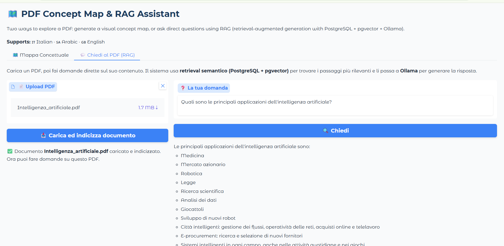
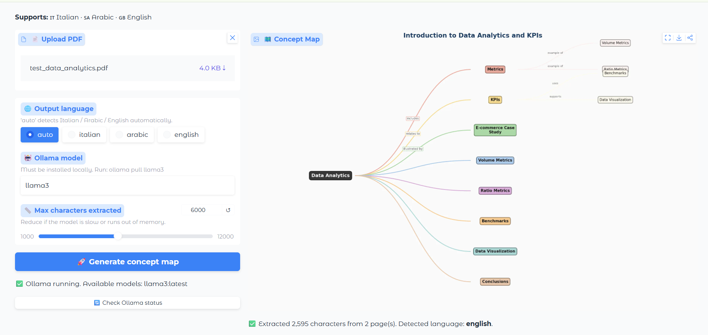

# 🗺️ PDF Concept Map Generator & RAG Assistant

[](https://python.org)
[](https://gradio.app)
[](https://ollama.com)
[](https://github.com/pgvector/pgvector)
[](tests/)
[](LICENSE)

Upload any PDF → get an interactive concept map, **or** ask direct questions about it using a full **RAG pipeline** (PostgreSQL + pgvector + Ollama).
Supports 🇮🇹 Italian · 🇸🇦 Arabic · 🇬🇧 English — with automatic language detection.

> Built from real experience at **Pedius Education** (Rome) working on multilingual
> PDF processing pipelines for AI-generated concept maps.

---

## 🎯 Problem

Reading a long PDF (academic paper, book chapter, report) takes time.
Understanding the key concepts and how they relate to each other takes even more.
And often you don't want a summary — you want to **ask a specific question** and get a grounded answer.

Most tools:
- Produce plain text, not structured knowledge
- Do not work offline (require API keys and internet)
- Do not support Arabic or other non-Latin scripts
- Don't let you *ask* the document anything

---

## 💡 Solution

Two complementary features, both 100% local:

### 1. Concept Map Generation
1. **Extracts text** from any PDF using PyMuPDF
2. **Detects the language** automatically (Italian / Arabic / English)
3. **Sends the text to Ollama** with a language-specific prompt
4. **Parses the JSON** concept map from the LLM response
5. **Renders an interactive graph** using NetworkX and Matplotlib

### 2. RAG Chat — Ask Questions About Your PDF
1. PDF text is extracted (PyMuPDF) and split into overlapping chunks
2. Each chunk is embedded locally with `sentence-transformers` (`all-MiniLM-L6-v2`)
3. Embeddings are stored in **PostgreSQL + pgvector** (running in Docker)
4. A user question is embedded and matched via **semantic similarity search** (`<->` operator on pgvector)
5. The most relevant chunks are passed to **Ollama** as context
6. Ollama generates an answer grounded in the retrieved content, with page-level source citations

Everything runs in a Gradio web interface — no internet required (Ollama and PostgreSQL both run locally).

---

## 🗂️ Project structure

pdf-concept-map/
├── README.md
├── AGENTS.md ← Architecture overview
├── requirements.txt
├── docker-compose.yml ← PostgreSQL + pgvector
├── init.sql ← DB schema (vector extension + documents table)
├── .env ← DB / Ollama config
├── .gitignore
├── LICENSE
├── src/
│ ├── app.py ← Gradio UI (main entry point, 2 tabs)
│ ├── pdf_extractor.py ← PDF text extraction + language detection
│ ├── llm_mapper.py ← Ollama API + JSON parsing (concept map)
│ ├── graph_renderer.py ← NetworkX graph → PNG
│ ├── database.py ← PostgreSQL/pgvector connection
│ ├── ingest.py ← Chunking + embedding + storage (RAG)
│ ├── rag.py ← Retrieval + Ollama generation (RAG)
│ └── test_rag.py ← Quick manual test script for the RAG pipeline
├── tests/
│ └── test_pipeline.py ← 12 unit tests (no Ollama required)
├── data/ ← Put your PDF files here
├── evaluation/
│ └── evaluate.py ← Batch CLI evaluation
├── assets/ ← Screenshots
└── docs/
└── architecture.md


---

## ⚙️ Installation

### 1. Install Ollama
```bash
# Linux / macOS
curl -fsSL https://ollama.com/install.sh | sh

# Windows: download from https://ollama.com
```

### 2. Pull a model
```bash
ollama pull llama3
# or for better multilingual support:
ollama pull mistral
```

### 3. Install Docker Desktop (for the RAG feature)
Download from [docker.com](https://www.docker.com/products/docker-desktop/) — required to run PostgreSQL + pgvector.

### 4. Clone and install dependencies
```bash
git clone https://github.com/abdel-2000/pdf-concept-map.git
cd pdf-concept-map

pip install -r requirements.txt
```

### 5. Start the vector database
```bash
docker-compose up -d
```
This spins up PostgreSQL with the pgvector extension already configured (schema auto-created from `init.sql`).

---

## 🚀 Run the app

```bash
# Start Ollama first
ollama serve

# Make sure the database is running
docker-compose up -d

# Then run the app
cd src
python app.py
```

Opens at `http://localhost:7860` with two tabs: **Concept Map** and **Chiedi al PDF (RAG)**.

---

## 🎬 Demo — Real run

Example of the full pipeline running end-to-end, from ingestion to a grounded answer:

**1. Ingest a PDF into the vector database:**
```bash
python ingest.py ..\data\Intelligenza_artificiale.pdf
```

Ingested 43 chunks from ..\data\Intelligenza_artificiale.pdf

The PDF was read, split into 43 overlapping text chunks, embedded locally, and stored in PostgreSQL + pgvector.

**2. Ask a question directly from the terminal:**
```bash
python test_rag.py
```

DOMANDA: Cos'è l'intelligenza artificiale?

RISPOSTA: Secondo il contesto, l'intelligenza artificiale è il termine ombrello che indica
l'insieme delle capacità il cui svolgimento richiederebbe normalmente un intelletto naturale,
ma che possono essere simulate, in tutto o in parte, da un sistema artificiale (tipicamente
informatico o di automazione).

FONTI: ['Intelligenza_artificiale.pdf (pagina 1)', '(pagina 15)', '(pagina 17)', '(pagina 3)']

The answer is generated by Ollama, grounded only in the retrieved chunks, with page-level citations.

**3. Launch the web interface:**
```bash
python app.py
```

Running on local URL: http://127.0.0.1:7860





---

## 🧪 Run tests (no Ollama required)

```bash
pytest tests/ -v
```

## 📋 Batch evaluation

```bash
python evaluation/evaluate.py --input data/ --model llama3 --language italian
```

---

## 🌐 Language support

| Language | PDF extraction | LLM prompt | Output labels |
|---|---|---|---|
| 🇮🇹 Italian | ✅ | ✅ | ✅ |
| 🇸🇦 Arabic (RTL) | ✅ | ✅ | ✅ |
| 🇬🇧 English | ✅ | ✅ | ✅ |
| Auto-detect | ✅ | — | — |

---

## 📊 Output example — Concept Map

```json
{
  "title": "Data Analytics",
  "nodes": [
    {"id": "1", "label": "KPI",     "type": "main"},
    {"id": "2", "label": "Metrics", "type": "sub"},
    {"id": "3", "label": "ROAS",    "type": "sub"}
  ],
  "edges": [
    {"from": "1", "to": "2", "label": "is measured by"},
    {"from": "1", "to": "3", "label": "includes"}
  ]
}
```

---

## ⚠️ Limitations

- Requires Ollama running locally — no cloud API used
- RAG feature requires Docker (PostgreSQL + pgvector container)
- Large PDFs are truncated for the concept map (configurable, default 6000 chars)
- Arabic PDF quality depends on the encoding used in the source file
- Map quality varies by model — `mistral` and `llama3` give best results
- Scanned PDFs (images) are not supported — text must be selectable

## 🔭 Future developments

- [ ] Support for scanned PDFs via OCR (Tesseract)
- [ ] Export map as interactive HTML (vis.js / D3.js)
- [ ] Multiple PDF comparison
- [ ] Re-ranking of retrieved chunks for better RAG accuracy
- [ ] OpenAI / Anthropic API as alternative to Ollama
- [ ] HuggingFace Space deployment

---

## 👤 Author

**Abdellatif El Majdoubi**
GitHub: [@abdel-2000](https://github.com/abdel-2000)
Master in Data Science & AI — UNINETTUNO, Rome
Internship: Pedius Education, Rome (AI & Robotics)

---

*MIT License © 2026 Abdellatif El Majdoubi*
